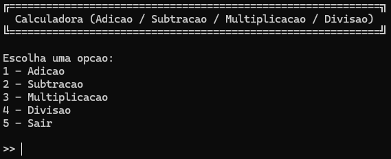
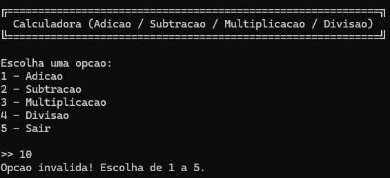
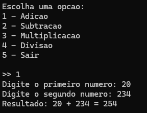
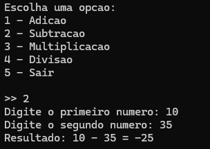
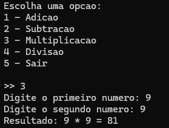
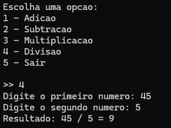
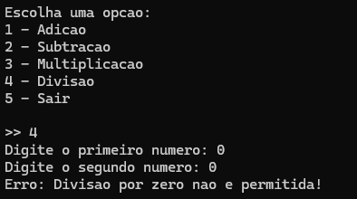

# CP1 - Desenvolvimento de uma calculadora em C# 
Uma aplicação em **C#** que implementa uma calculadora com as operações básicas: adição, subtração, multiplicação e divisão.

### Integrantes 
- Mariana Neugebauer Dourado | RM550494

---

## Tela - Opções de Menu 

## Tela - Opções de Menu + Erro

## Tela - Opção Soma

## Tela - Opção Subtração

## Tela - Opção Multiplicação 

## Tela - Opção Divisão

## Tela - Opção Divisão + Erro

